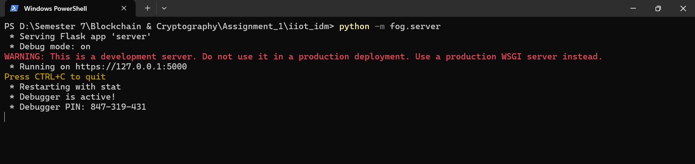
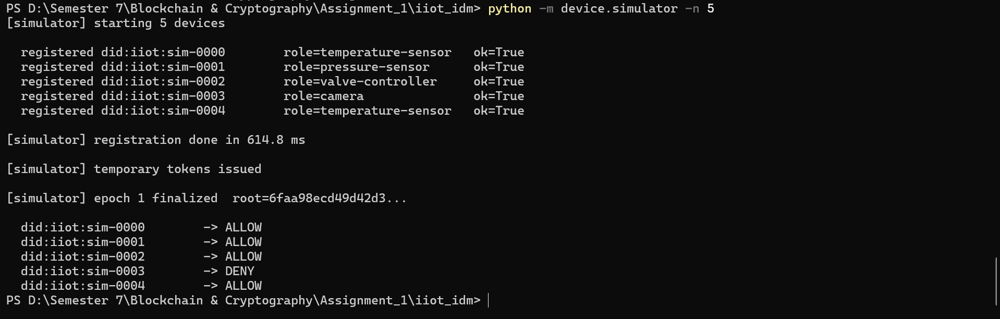
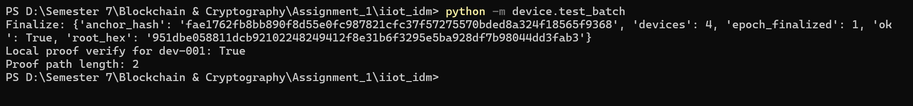
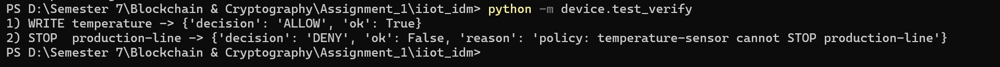
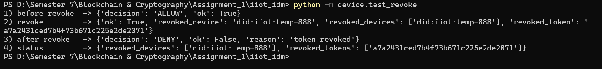
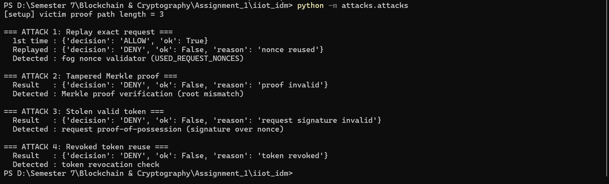
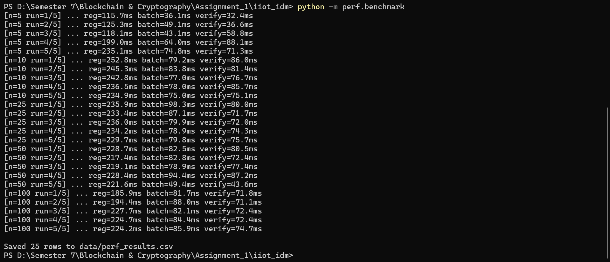
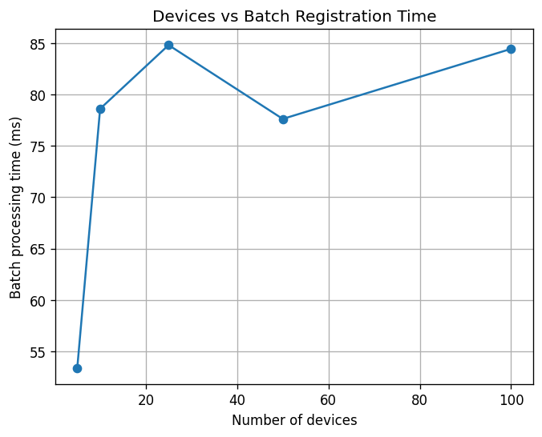
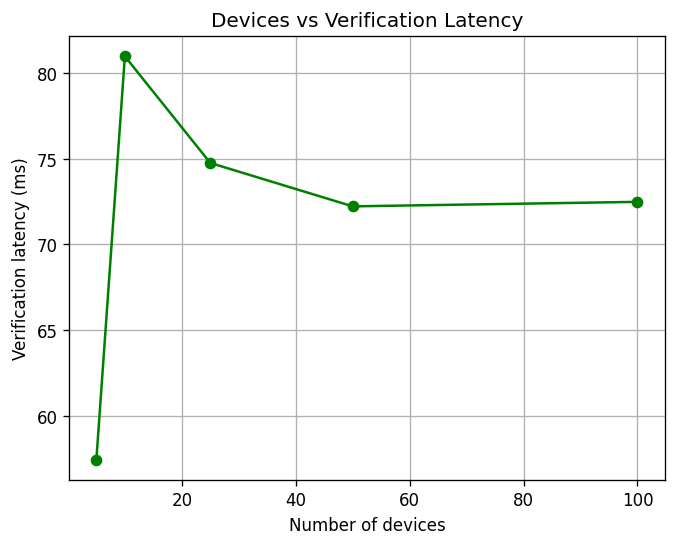
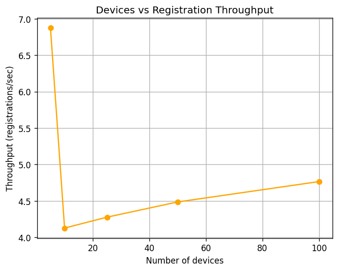

# Single-Zone IIoT Decentralized Identity Management Framework

**Course:** Blockchain & Cryptography — Assignment 1
**Team:** Muhammad Shahzaib (23i-2105), Lutfan Shahzad (23i-2114)
**Date:** September 2026

---

## 1. Introduction and Architecture

We implement a single-zone IIoT identity-management framework consisting of one fog node and multiple simulated devices. Devices perform only lightweight operations like key generation, hashing, and signing while the fog handles all computationally intensive work: batch aggregation, Merkle tree construction, proof generation, token issuance, verification, and revocation.

### 1.1 Components

| Component | Role |
|---|---|
| **IIoT device (simulated)** | Generates DID + ECC keypair, signs PoP challenges, requests tokens, submits proofs |
| **Fog node (Flask)** | Authenticates devices, forms batches, builds trees, anchors roots, issues tokens, verifies requests, enforces policy, manages revocation |
| **Root registry (hash chain)** | Append-only ledger simulating blockchain anchoring of epoch roots |
| **Policy module** | Role → resource → allowed-operations map |
| **Attack suite** | Four scripts demonstrating replay, tampering, theft, and revocation |
| **Benchmark + plotter** | Measures scalability; produces three required graphs |

### 1.2 Data flow

```
   Device                    Fog Node                  Root Registry
      |                         |                            |
      |--- PSK auth ----------->|                            |
      |--- PoP signature ------>|                            |
      |--- DID + PK + metadata->|                            |
      |                         |--- sort + build tree       |
      |                         |--- anchor root ----------->|
      |<-- token + proof path --|                            |
      |--- resource request --->|                            |
      |    (proof + token       |--- verify proof            |
      |     + fresh signature)  |--- check token/revocation  |
      |                         |--- apply policy            |
      |<-- ALLOW / DENY --------|                            |
```

### 1.3 Trust model

- Devices are untrusted until they complete PSK bootstrap + proof-of-possession.
- Fog node is trusted for this assignment (single zone); multi-fog trust is deferred to Assignment 2.
- Root registry is append-only — anchored roots cannot be retroactively altered.
- Private keys never leave devices; the fog only sees public keys and signatures.

### 1.4 Stack and cryptographic primitives

| Layer | Technology |
|---|---|
| Language | Python 3.14 |
| Fog server | Flask 2.3.3 |
| Transport | HTTPS via self-signed certificate (TLS 1.3) |
| Crypto library | `cryptography` (ECDSA P-256, RSA, X.509) |
| Hashing | `hashlib` (SHA-256) |
| State | In-memory dicts + append-only hash chain |
| Graphs | `matplotlib` |

| Primitive | Where used |
|---|---|
| ECDSA P-256 | Device identity keys, fog signing key |
| SHA-256 | Leaf `Ld = H(DID‖PK)`, internal Merkle nodes, anchor hash |
| Canonical serialization | `DID \|\| "\|" \|\| PK` before hashing |
| Fresh nonces | PoP challenge, resource request |
| Nonce blacklist | `USED_NONCES`, `USED_REQUEST_NONCES` |
| Fog-signed tokens | Temporary tokens (Phase 2) |
| Hash-chained registry | Epoch anchor records |

---

## 2. Implementation

### 2.1 Phase 1 — Registration and Batch Formation

**Onboarding sequence.** Each device: (1) POSTs `/register/start` with a pre-shared key, receiving a session ID; (2) generates a `did:iiot:<name>` and an ECDSA P-256 keypair locally (private key never transmitted); (3) POSTs `/register/challenge` with the public key and receives a fresh 32-byte nonce; (4) signs the nonce and POSTs `/register/complete` with DID, PK, signature, and metadata. The fog verifies: session validity, nonce TTL (60 s), nonce match and non-reuse, public-key match, and ECDSA signature. On success, the device's leaf `Ld = SHA256(DID || "|" || PK_hex)` is appended to the current batch.

**Why PoP matters.** Copying a DID and public key is trivial. PoP forces the requester to sign a fresh, fog-generated nonce with the private key matching the claimed public key blocking both impersonation and replay of an old valid signature.

**Batch finalization.** At the end of a registration window, the fog: collects all leaves, sorts them deterministically (bytewise), builds the Merkle tree once, computes a single root, and anchors it in an append-only hash chain (`anchor_hash = SHA256(epoch || root || timestamp || prev_hash)`). It then generates and signs an inclusion proof per device (`Sign_Fog(leaf || root || epoch)`), increments the epoch, and clears the batch. Each device stores its proof package locally and reuses it indefinitely — the epoch root is frozen.

### 2.2 Phase 2 — Temporary Token Bridging

A device registering mid-epoch has no Merkle proof yet. To bridge this window, the fog issues a short-lived, fog-signed token bound to the device:

```
Issue(d) = DID || PK || scope || issued_at || expires_at || token_id
τ_d = Sign_Fog( Issue(d) )
```

Demo TTL is 300 s. On every resource request the fog rejects unless: token exists, token signature valid, `now < expires_at`, `token_id ∉ REVOCATIONS`, and `token.did/pk` match the request. A stolen token is still insufficient, each request includes a fresh device-generated nonce and a signature over `nonce || resource || operation` using the device's private key. The fog verifies this signature and rejects reused nonces. This converts the token from a bearer credential into a proof-of-possession credential. Once the epoch closes, the device transitions to its permanent Merkle proof.

### 2.3 Phase 3 — Verification and Resource Authorization

Verification asks *"was this DID + PK registered in a trusted epoch?"*; authorization asks *"may this device perform this operation now?"* A device can pass the first and fail the second.

**Pipeline.** For each request the fog: (1) resolves `ANCHORED_ROOTS[epoch]`; (2) recomputes `Ld = SHA256(DID‖PK)`; (3) verifies the Merkle proof against the anchored root; (4) validates the token; (5) checks nonce non-reuse; (6) verifies the request signature `Sign_SKd(nonce‖resource‖operation)`; (7) applies the policy. Every check must pass for **ALLOW**.

**Policy** is a two-level map `role → resource → [operations]`:

```python
POLICY = {
    "temperature-sensor": {"temperature":      ["WRITE", "READ"]},
    "pressure-sensor":    {"pressure":         ["WRITE", "READ"]},
    "valve-controller":   {"valve":            ["WRITE", "READ"],
                            "production-line": ["STOP"]},
    "camera":             {"stream":           ["READ"]},
}
```

A camera attempting `WRITE stream` is rejected even though its identity is valid i-e the identity ≠ authorization demonstration.

### 2.4 Revocation

Two-layer model:

| Layer | Latency | Scope |
|---|---|---|
| Local block | Immediate | `REVOCATIONS` set on fog; token rejected on next request |
| Epoch exclusion | Next epoch | Device skipped from future batch and root |

The old anchored root is never modified while historic proofs remain mathematically verifiable. Access is controlled by current revocation state, not by rewriting history. Both layers are needed: immediate blocking must not wait for the next epoch boundary, and old proofs will always verify against their historic root.

---

## 3. Security Analysis

Four attacks implemented in `attacks/attacks.py`:

| Attack | Setup | Detected by | Result |
|---|---|---|---|
| Replay of exact request | Capture and resend a valid request verbatim | Nonce blacklist (`USED_REQUEST_NONCES`) | DENY — nonce reused |
| Tampered Merkle proof | Flip one bit in a sibling hash | Merkle verifier (recomputed root ≠ anchored root) | DENY — proof invalid |
| Stolen valid token | Attacker holds token + proof but not private key | Request PoP signature check | DENY — request signature invalid |
| Revoked token reuse | Use an unexpired but revoked token | `REVOCATIONS` check | DENY — token revoked |

Each denial occurs at a distinct, explainable stage in the verification pipeline. No single check is redundant with another.

---

## 4. Performance Evaluation

### 4.1 Methodology

Device counts 5, 10, 25, 50, 100; 5 runs each (25 measurements); fog state reset between runs; traffic over TLS; timings captured client-side with `time.perf_counter()`.

### 4.2 Results (avg over 5 runs)

| Metric | n=5 | n=10 | n=25 | n=50 | n=100 |
|---|---|---|---|---|---|
| Registration (ms) | 159 | 243 | 234 | 223 | 211 |
| Batch processing (ms) | 53 | 79 | 85 | 78 | 84 |
| Verification (ms) | 57 | 81 | 75 | 72 | 73 |

n=5 is a warm-up outlier after `/reset`; values from n=10 onward are used for trend analysis.

### 4.3 Interpretation

- **Registration:** 211–243 ms (mean ≈ 228). No meaningful growth with N.
- **Batch processing:** 78–85 ms (mean ≈ 82). Roughly constant from N=10 to 100. Merkle work is O(n log n) but is dwarfed by fixed per-request overhead at these sizes.
- **Verification:** 72–81 ms (mean ≈ 75). Stable across N. Proof path length is O(log n), matching the paper's claim.
- **TLS overhead dominates.** Plain-HTTP runs showed reg ≈ 20 ms and verify ≈ 6 ms — a ~10× difference caused by per-request TLS handshakes (each `requests.post()` opens a fresh session). Production with pooling and TLS session resumption would reduce this by 5–10×, leaving the identity framework itself lightweight.

At N ≤ 100, batch-time variation is dominated by TLS handshake jitter rather than tree work. Section 5's HTTP-only comparison isolates and exposes the pure Merkle cost.

---

## 5. Batch vs Individual Registration

If each arriving device triggers a tree rebuild, we get **N root updates per batch**, every arrival can invalidate other devices' sibling hashes, and up to **N(N−1)/2 stale proofs** require redistribution.

Measured (`perf/batch_vs_individual.py`):

| N | Individual (ms) | Batch (ms) | Speedup | Root updates | Stale proofs |
|---|---|---|---|---|---|
| 5 | 0.0 | 0.0 | 1.6× | 5 | 10 |
| 10 | 0.2 | 0.1 | 3.3× | 10 | 45 |
| 25 | 1.0 | 0.1 | 9.4× | 25 | 300 |
| 50 | 2.1 | 0.2 | 11.6× | 50 | 1,225 |
| 100 | 5.7 | 0.3 | 19.6× | 100 | 4,950 |
| 200 | 24.4 | 0.7 | 34.3× | 200 | 19,900 |

Batch registration delivers sub-linear tree-construction cost, one root per epoch instead of N, and zero proof churn within a batch. The saving grows with N which is exactly what a scalable IIoT identity system requires.

---

## 6. Problems Encountered and Design Decisions

### 6.1 Problems

| Problem | Resolution |
|---|---|
| Self-signed TLS caused `CERTIFICATE_VERIFY_FAILED` in clients | `Session.request` monkey-patch to disable cert verification (demo only) |
| Flask CLI (`flask run`) ignored `ssl_context` | Switched to `python -m fog.server` |
| Benchmark accumulated fog state → wrong trends | Added `/reset` endpoint called before each run |
| Tampered-proof attack crashed on single-leaf tree (empty proof) | Register 4 filler devices so victim has a real proof path |
| Odd leaf count in Merkle tree | Duplicate last leaf (standard convention) |

### 6.2 Design decisions

| Decision | Rationale |
|---|---|
| ECDSA P-256, not RSA | Smaller keys, faster, standard on IIoT hardware |
| Regular Merkle tree, not SMT | Sufficient for single-zone membership; SMT deferred to Assignment 2 |
| Fresh nonces in every request | Replay protection at every step, not just initial auth |
| Two-layer revocation | Immediate local block + epoch exclusion: fast response plus long-term consistency |
| Hash-chain root registry | Demonstrates anchoring immutability without full blockchain overhead |
| Self-signed TLS | Satisfies the protected-connection requirement in a demo setting |

---

## 7. Contribution Table

| Student | Main components | Important files | Testing performed |
|---|---|---|---|
| **Lutfan Shahzad (23i-2114)** | Crypto primitives, Merkle tree, fog server core (register, batch, verify, revoke), attacks, performance benchmark | `fog/crypto.py`, `fog/merkle.py`, `fog/models.py`, `fog/server.py`, `attacks/attacks.py`, `perf/benchmark.py` | Unit tests for crypto & Merkle; attack suite; scalability runs; batch-vs-individual comparison |
| **Muhammad Shahzaib (23i-2105)** | Device simulator, token module, access policy, TLS transport, README, plots, screenshots | `device/simulator.py`, `fog/policy.py`, `fog/token.py`, `fog/gen_cert.py`, `perf/plot.py`, `README.md` | Integration test of simulator; TLS handshake; policy decisions; graph generation; demo capture |

All code is available on GitHub with per-author commit history.

---

# Appendix A — Screenshots

### A.1 Fog node startup (HTTPS)

Fog runs on `https://127.0.0.1:5000` with a self-signed TLS certificate.

### A.2 Device registration

Five simulated devices with mixed roles register sequentially via PSK + PoP.

### A.3 Batch finalization and proof verification

Batch finalized; one root anchored; proof path of length 2 verified locally against the anchored root.

### A.4 Verification: ALLOW and DENY

`WRITE temperature` → ALLOW; `STOP production-line` → DENY. Identity ≠ authorization.

### A.5 Revocation

Before revoke: ALLOW. After `/revoke`: DENY — token revoked. Historic proofs remain valid.

### A.6 Security attacks

All four attacks blocked: replay, tampered proof, stolen token, revoked token.

### A.7 Performance benchmark

5 runs per device count across 5, 10, 25, 50, 100 devices.

### A.8 Scalability graphs


**Batch processing time vs device count.** Absolute values include TLS handshake overhead; pure Merkle cost is isolated in Section 5.


**Verification latency vs device count.** Remains roughly stable (72–81 ms), matching the O(log n) proof-path expectation.


**Registration throughput vs device count.** Plateaus, confirming per-operation cost does not grow with N.